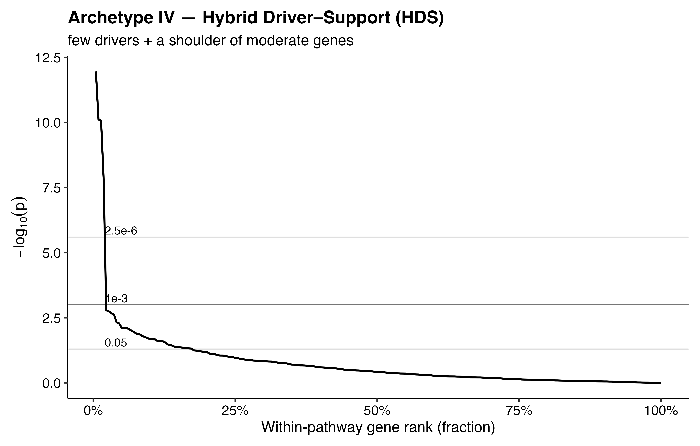

# CATFISH : GWAS pathway analysis pipeline

This Markdown is structured into:

- [**INTRODUCTION**](#introduction) — what the pipeline is and why multiple tests are needed  
- [**METHODS**](#methods) — paper‑ready subsections with explicit equations and assumptions  
- [**USAGE**](#usage) — installation + reproducible example commands and R snippets
- [**RESULTS**](#results) — an example analysis for soil Nitrogen GWAS

---

## INTRODUCTION

### What CATFISH is

**CATFISH** (Combining <ins>**C**</ins>auchy (ACAT) <ins>**A**</ins>daptive TFisher (soft), <ins>**F**</ins>isher, m<ins>**I**</ins>n-P, and <ins>**S**</ins>touffer for <ins>**H**</ins>olistic pathway analysis) is a multi-test pathway framework built on LD-aware MAGMA gene-level GWAS statistics adjusted for gene length and SNP density that combines ACAT, soft TFisher, Fisher, Stouffer and minP. It then uses an omnibus test based on permutation-calibrated minP or ACAT to collapse these multiple pathway tests into a single, correlation-robust enrichment p-value that is sensitive to both sparse and polygenic pathway patterns. In short, CATFISH casts a wide net across complementary tests and reels in a single pathway p-value.

CATFISH uses:

1. **MAGMA** for LD-aware **SNP → gene** inference (gene-level p-values).
2. **Multiple gene → pathway combination tests** (ACAT, Fisher, soft TFisher, Stouffer, minP).
3. A **correlation-robust LD-aware omnibus test** (permutation-calibrated minP and ACAT-O) that aggregates these tests into a single pathway-level p-value.

### Why multiple tests are needed

Pathways can be significant for statistically different reasons:

- one driver gene dominates,
- many genes show coordinated moderate enrichment,
- diffuse polygenic shift, and
- hybrids of these patterns.

No single gene-set statistic is uniformly most powerful across these various possibilities. Instead of relying on a single test, CATFISH runs several complementary pathway tests and combines them into one omnibus p-value. We summarize these patterns using a set of **pathway signal archetypes** (sparse driver, coordinated moderate enrichment, diffuse polygenic shift, hybrid driver–support, single-gene proxy), which describe different ways a pathway can appear significant.

# Pathway signal archetypes

We divide the pathway signals into a set of archetypes that describe different ways a pathway can be important in a biological sense explained in detail below. We then use a combination of statistical tests chosen to be representative to each of these behaviors and a provide a biological example for each archetype.

## Archetype I — Sparse Driver Architecture (SDA)


*Archetype I: Sparse Driver Architecture (SDA).*

**Signature:** A small number of genes are extremely significant; most genes look null.

**Gene-level p-value pattern:**

- There exists a small $K \ll G$ such that the top $K$ gene p-values are extremely small, $p_{(1)}, \dots, p_{(K)} \ll \alpha$ (e.g. $p_{(1)} \sim 10^{-7}$ or smaller),
- The remaining genes are approximately null, $p_{(K+1)}, \dots, p_{(G)} \sim \mathrm{Uniform}(0,1)$.
- This produces a sharp “elbow” in the ranked p-values (a few tiny hits followed by a long flat tail).

**Interpretation:**  
An SDA pathway is significant because **a small set of driver genes dominates the signal**, rather than broad involvement of most pathway members. This can occur when the trait-relevant biology passes through a **bottleneck** (committed step, rate-limiting enzyme, key regulator, or essential transporter) so that genetic variation concentrates its effect at a few control points. In contrast, pathway annotations typically include many additional enzymes, modifiers, and general “support” genes that may be necessary for pathway operation but do not carry strong association for the trait. Under SDA, association is therefore concentrated in the top $K$ genes, yielding very small ordered p-values $p\_(1), …, p_(K)$ followed by a long tail $p_(K+1), …, p_(G)$ that is close to uniform.

**Biological example:**  
**Aspartokinase in the aspartate-derived amino acid pathway**

The aspartate-derived amino-acid biosynthesis pathway converts **aspartate** into essential amino acids, such as **lysine**, **threonine**, **methionine**, and **isoleucine**. In plants and bacteria, the first step is catalyzed by **aspartokinase (AK)**, which phosphorylates aspartate to **aspartyl-phosphate** that feeds multiple branched network to produces several end-products. Due to its position at the starting point of the pathway, AK acts as a **flux-controlling bottleneck**. Variations in AK activity alter carbon and nitrogen flow through the whole network. Downstream enzymes, including tailoring steps, dehydrogenases, and transaminases, typically exhibit dispersed or buffered roles. Thus, the gene-level pattern aligns with SDA. A single AK gene or a few genes downstream exhibit very low $p$ values (e.g. $10^{-8}\text{-}10^{-10}$), while the majority are dispersed across the interval $(0,1)$.

**Best detectors in CATFISH:**
- **ACAT** — sensitive to a few extremely small p-values (RECOMMENDED).  
- **minP / Tippett** — targets the minimum p-value; optimal when one gene dominates.


---

## Archetype II — Coordinated Moderate Enrichment (CME)


*Archetype II — Coordinated Moderate Enrichment (CME)*


**Signature:** many genes show moderate association; no single gene is extremely low.

**Gene-level p-value pattern:**
- A non-trivial fraction of genes have moderately small p-values, e.g.
  $$p_i \in [10^{-3},\,0.05]\quad\text{for many } i.$$
- The top signal is not orders-of-magnitude beyond the rest (no single-gene spike), e.g.
  $$p_{(1)} \not\ll p_{(k)}\quad\text{for small }k\ (\text{e.g., }k=5,10,20).$$
- The ranked p-values show a **broad shoulder** (many good genes) but not a sharp elbow.

**Interpretation:**  
CME signifies **collective functional engagement**. The pathway behaves like a coordinated module wherein numerous components exert small-to-moderate effects. This is expected when phenotypes emerge from distributed regulation, redundancy, and buffering/feedback as dramatic single-gene effects are rare. Statistically, enrichment arises from numerous mildly informative genes rather than single driver.

**Biological example:**  
**Cytokine / immune signaling cascades**

In numerous immunological pathways, the output is regulated not by a singular "master gene," but through **distributed modulation across various tiers** of a signaling circuit. A clear example is **TNFα / IL-1β → NF-κB**, where the engagement of upstream receptors ultimately activates **IKK complexes**, which phosphorylate **IκB inhibitors**, facilitating the nuclear translocation of NF-κB family members. Notably, the **temporal dynamics** of NF-κB activation (rapid/transient versus slower/sustained) are significantly influenced by the **stimulus class** and receptor context  (Zhao et al., 2018).The significance of these dynamics lies in the variability of transcriptional outputs influenced by stimulus, NF-κB family composition, and cell type. Core feedback and marker targets encompass genes such as **NFKBIA (IκBα)** and **TNFAIP3 (A20)**, underscoring the notion that pathway behavior is governed by numerous regulatory nodes rather than a singular switch (Zhao et al., 2018).

This “many-knobs” architecture is also apparent one layer upstream in **TNFRSF signaling**. TNFRSF receptors bind trimeric TNFSF ligands, however, increasing evidence suggests that **a single trimeric ligand–receptor complex fails** to elicit complete signaling output. Rather, for certain TNFRSF pathways (notably the **classical NF-κB pathway**), successful activation may necessitate **secondary interactions or clustering of multiple trimeric receptor complexes** (Medler et al., 2019). Mechanistically, this indicates that pathway output relies on the coordinated effects of receptor assembly/avidity, adaptor recruitment, kinase activation thresholds, and the strength of negative feedback—precisely the type of system where typical genetic variation is anticipated to produce **numerous modest perturbations** rather than a singularly significant driver.

In CATFISH terminology, this yields a CME pattern: within a cytokine/immune circuit, gene-level p-values exhibit a surplus of moderate signals (e.g., numerous genes around 10⁻³–10⁻²) without a singular extreme outlier:
$$ (p_{(1)}, p_{(2)}, \ldots) \text{ comprises numerous values approximately in the range of } 10^{-3} \text{--}10^{-2} \text{ without an extreme such as } 10^{-12}.Consequently, CME pathways are optimally represented by **evidence-accumulating tests** (e.g., Fisher, Stouffer/mean-Z, and mild-truncation/soft-TFisher), whose efficacy is enhanced when *numerous* route members exhibit moderate associations, rather than depending on a singular peak.

**Best detectors in CATFISH:**
- **Fisher’s method** (aggregates evidence across many moderately small p-values) (RECOMMENDED).
- **Stouffer / mean-Z** (gains power when many genes shift together).
- Optionally **wFisher / weighted Z** if you later add biologically informed weights.


---

## Archetype III — Diffuse Polygenic Shift (DPS)


*Archetype III — Diffuse Polygenic Shift (DPS)*


**Signature:** the pathway’s genes are, on average, slightly more associated than the genome-wide background, but almost none cross a conventional significance threshold.

**Gene-level p-value / Z pattern:**
- Most gene p-values satisfy:
  $$p_i > 0.05\quad\text{for most } i.$$
Yet the pathway shows a small but consistent shift in adjusted gene-level Z-scores:

$$
\overline{Z}_{S,\mathrm{adj}} \;=\; \frac{1}{G}\sum_{i\in S} Z_{i,\mathrm{adj}} \;\neq\; 0,
$$

often with a coherent sign (bias in one direction).
- Equivalent distributional statement:
  $$\{p_i: i\in S\}\ \text{is subtly enriched toward smaller values relative to Uniform}(0,1),$$
  but without extreme outliers.
- No sharp elbow, instead, the ranked p-values show a gentle, global downward bend relative to null.

**Interpretation:**  
DPS indicates a **global pathway bias aligned with polygenicity**: numerous genes individually exert minimal impacts in a uniform direction, resulting in pathway enrichment due to the collective subtle shift of the entire module rather than the influence of a singular "star" gene. This is the regime characterized by numerous little issues and the absence of significant challenges. Spike-hunting tests, such as minP/Tippett or highly aggressive truncation, are generally underpowered in this context due to the absence of a singular extreme p-value to leverage. Conversely, mean-/distribution-sensitive tests (Stouffer/mean-Z, Fisher, and competitive regression) are specifically formulated to identify this subtle, pervasive divergence from the null hypothesis.

**Biological example:**  

**Biological example – human height as a diffuse polygenic shift**

The height of adult humans exemplifies a highly polygenic characteristic. Initial GIANT meta-analyses involving over 180,000 individuals identified 180 loci and "hundreds of variants" associated with height. Nevertheless, they accounted for merely 10% of the phenotypic variance, despite height exhibiting approximately 80% heritability. Subsequent meta-analyses involving about 700,000 Europeans identified thousands of linked SNPs and hundreds of locations, validating the perspective that height is regulated by several common variants of minimal effect rather than a limited number of high-impact genes. A recent investigation of a "saturated map" identified over 12,000 genome-wide significant SNPs across more than 7,000 genomic segments, encompassing around 21% of the genome, thereby reaffirming Fisher’s original polygenic hypothesis for height proposed in 1918.

These variants are classified into several growth-related programs, such as chondrocyte proliferation and hypertrophy in the growth plate, extracellular matrix and cartilage organization, growth hormone and IGF-1 signaling, and morphogen pathways including TGF-β and Hedgehog, as well as overarching developmental and endocrine regulators. Analyses of height GWAS loci through pathway and gene-set evaluations have demonstrated enrichment for signaling pathways such as TGF-β and Hedgehog, as well as for genes associated with skeletal growth, growth plate regulation, and pertinent Mendelian growth disorders. Lango Allen et al. (2010) discovered that genes adjacent to height-associated variants congregate in biologically coherent pathways, including TGF-β signaling, Hedgehog signaling, and histone and growth/development gene sets. Furthermore, several SNPs near these pathway genes "narrowly miss" genome-wide significance, suggesting numerous additional sub-threshold contributors within the same modules. Guo et al. (2018) demonstrate that genes adjacent to height GWAS loci are enriched in processes and tissues pertinent to growth, including growth plate cartilage.

When examined at the level of an individual pathway (e.g., TGF-β signaling, Hedgehog signaling, or growth-plate extracellular matrix genes), this structure inherently produces a **Diffuse Polygenic Shift (DPS)** pattern. Throughout the gene set, numerous genes possess one or more prevalent variations that have minor impacts on height. Certain genes attain definitive genome-wide relevance, while many others exhibit relatively mild or nominal associations. The outcome indicates that, in contrast to random gene sets, the distribution of gene-level test statistics within these pathways exhibits a shift towards more robust evidence overall characterized by an increased number of genes with small or moderate p-values and a decreased number of genes appearing entirely null—despite the fact that most individual genes would not, on their own, substantiate a strong association claim. This scenario exemplifies the optimal application of CATFISH’s DPS-oriented detectors (Stouffer/mean-Z on adjusted gene-level Z-scores, and optionally MAGMA-style competitive regression tests). They assess whether the **average** association signal across a biologically coherent pathway is subtly yet consistently heightened in comparison to the genome-wide background.

**Best detectors in CATFISH:**
- **Stouffer / mean-Z on** `Z_adj` (unweighted; permutation-calibrated) (RECOMMENDED).
- Optionally **competitive regression-style gene-set models** (e.g., **MAGMA competitive**) if included as a component test (NOT INCLUDED IN CATFISH)


---

## Archetype IV — Hybrid Driver–Support (HDS)


*Archetype IV — Hybrid Driver–Support (HDS)*


**Signature:** a few very strong genes plus a some moderately associated genes.

**Gene-level p-value pattern:**
- One or a few top genes are extremely significant, e.g.
  $$p_{(1)},\,p_{(2)} \ll 10^{-4}\quad(\text{often much smaller}).$$
- Beyond the top hits, several additional genes show moderate evidence:
  $$p_{(k)} \in [10^{-3},\,0.05]\quad\text{for multiple }k \text{ (support genes).}$$
- The remaining genes are near-null:
  $$p_{(j)} \sim \mathrm{Uniform}(0,1)\quad\text{for most other }j.$$
- A small “spike” at the top (drivers) plus a clear “shoulder” of moderately small p-values (support), then a flat tail.

**Interpretation:**  
HDS exhibits a **hierarchical pathway structure**. A small number of “driver” genes exert the most significant effects, whilst a group of genes provides modest yet persistent associations. This is prevalent in pathways where flow or signal is regulated by a limited number of control points, whereas effective route output also relies on the synchronized activity of various downstream components. This architecture is statistically positioned between Sparse Driver (single spike) and Coordinated Moderate Enrichment (wide shoulder). A distinct driver signal exists, although the significance of the pathway is augmented by supplementary moderate signals.

**Biological example** 
**LDL cholesterol as a hybrid driver–support pathway**

The regulation of LDL-cholesterol (LDL-C) exemplifies a scenario in which a limited number of genes serve as primary "drivers" within a more extensive polygenic framework. Extensive GWAS and sequencing investigations consistently identify *LDLR*, *APOB*, and *PCSK9* as fundamental genes associated with Mendelian hypercholesterolemia. Infrequent coding or splice-altering variants in these genes can alter LDL-C by approximately half a standard deviation or more and are responsible for classical familial hypercholesterolemia, significantly elevating the risk of coronary artery disease. Recent whole-genome sequencing investigations involving over 60,000 individuals reveal that even infrequent *non-coding* variations next to *LDLR* and *PCSK9* can exert effects comparable to clinically recognized exonic FH variants, hence supporting their significance as primary regulators of LDL-C homeostasis.

A supporting network of lipoprotein and cholesterol metabolism genes surrounds these drivers. GWAS of traditional lipids and nuclear magnetic resonance (NMR)-based lipoprotein characteristics have revealed numerous new loci affecting LDL particle size, concentration, and composition, including apolipoprotein clusters (*APOE/APOC*, *APOA1/A5*), hepatic lipase (*LIPC*), and transporters such as *ABCG5/ABCG8*. Individually, prevalent variants at these loci typically elucidate only a minor proportion of LDL-C variance, however, collectively, they constitute a significant segment of the genome-wide polygenic signal. Recent extensive multi-ancestry meta-analyses now identify hundreds of lipid-associated loci distributed throughout this extensive lipoprotein network.

Translating this biology into gene-level association statistics for an LDL-related trait reveals that the route is neither exclusively "sparse driver" nor entirely "coordinated moderate". Typically, one observes several robust gene-level signals at *LDLR*, *APOB*, *PCSK9*, and a few linked loci, supported by a wider array of modestly correlated genes implicated in lipoprotein assembly, remodeling, and cholesterol transport. The **Hybrid Driver–Support (HDS)** pattern is characterized by a pathway whose enhancement is indicative of both a limited number of predominant, high-impact genes and a legitimate, albeit subtler, influence from the broader metabolic framework. In CATFISH terminology, this refers to the regime when **soft TFisher** (which prioritizes the lower tail while still considering moderate p-values), along with **Fisher** and the **omnibus combination**, aligns effectively with the underlying biology.

**Best detectors in CATFISH:**
- **Soft TFisher** (tail-focused; gains power from a few strong hits *plus* additional modest hits)
- **Fisher** (accumulates evidence across the moderate support set)
- **Omnibus combination** (e.g., ACAT across ACAT/Fisher/soft-TFisher/Stouffer; or permutation-calibrated minP across methods)

---

## Archetype V — Single-Gene Proxy Pathway (SGP)


*Archetype V — Single-Gene Proxy Pathway (SGP)*


**Signature:** the pathway looks significant only because it contains one very strong gene; the remaining members look essentially null.

**Gene-level pattern:**
- The top gene has an extremely small p-value (e.g. $10^{-7}\text{--}10^{-12}$).
- The rest of the genes have p-values that look noisy / $\mathrm{Uniform}(0,1)$, with no clear excess of small p’s.
- If you ignore the top gene, there is no obvious enrichment left in the pathway.

**Interpretation:**  
The pathway effectively serves as a proxy for a singular gene-level relationship. This frequently occurs when:
- an annotation term is very small (one gene plus a couple of weakly related neighbors), or
- numerous pathway definitions redundantly incorporate the same driver gene, resulting in several "distinct" pathways activating while all reference the same underlying gene.

Biologically, the driver gene remains significant (and may also align with the SDA), although the pathway-level assertion provides no additional information beyond indicating that "this gene is strongly associated." In CATFISH, we consequently designate SGP patterns as a cautionary note: view these as gene-centric findings with associated pathway designations, rather than as proof that the entire pathway is collectively activated.

**Biological example:**  
**PAH in phenylalanine metabolism**

In humans, phenylalanine metabolism is primarily regulated by a singular bottleneck enzyme, phenylalanine hydroxylase (PAH), a hepatic monooxygenase that catalyzes the conversion of phenylalanine to tyrosine in a process dependent on tetrahydrobiopterin (BH₄) (Scriver, 2007; Elhawary et al., 2022). Classical phenylketonuria (PKU) and associated forms of hyperphenylalaninemia (HPA) occur when phenylalanine hydroxylase (PAH) activity is significantly diminished, resulting in markedly elevated blood phenylalanine levels, relatively decreased tyrosine levels, and the accumulation of neurotoxic metabolites. This culminates in the distinctive untreated PKU phenotype characterized by extremely high phenylalanine, low tyrosine, and progressive neurological impairment (Elhawary et al., 2022). Extensive clinical and molecular studies indicate that the predominant cause of HPA/PKU cases is pathogenic variants in PAH, whereas a minority results from deficiencies in BH₄ synthesis, recycling, or the PAH co-chaperone DNAJC12 (Blau et al., 2014; Himmelreich et al., 2021; Elhawary et al., 2022). In summary, within the overarching "phenylalanine metabolism" pathway, PAH represents the pivotal flux-controlling step. Both common and rare variations at PAH significantly influence systemic phenylalanine levels, while the majority of other pathway components (transporters, minor side-enzymes, cofactor recycling genes) have considerably weaker or less frequent effects at the population level.

**Best detectors in CATFISH:**
- **minP / Tippett** 
- **ACAT** 

---

## Archetype VI — Competitive Enrichment Above Background (CEAB)


*Archetype VI — Competitive Enrichment Above Background (CEAB)*


**Signature:** the pathway is not merely “associated”; it is enriched above the genome-wide polygenic background. It passes a MAGMA competitive test ($\beta_s > 0$), indicating that genes inside the set exhibit, on average, greater associated than those outside the set.

**Gene-level pattern:**

Let $Z_g$ be the gene-level $Z$ used by MAGMA, derived from gene p-values via a probit transform (higher $Z$ = stronger association).  
In a CEAB pathway $s$:

- The distribution of $\{Z_g : g \in s\}$ is elevated in comparison to $\{Z_g : g \notin s\}$. Equivalently, $\mathrm{mean}(Z_{\mathrm{in\_set}}) > \mathrm{mean}(Z_{\mathrm{outside\_set}})$, rather than merely $\mathrm{mean}(Z_{\mathrm{in\_set}}) > 0$.
- The signal is generally not represented by a single-gene proxy; rather, one may see multiple modestly strong genes or a small top-tail alongside an elevated mean. The crucial aspect is that the *average* in-set relationship surpasses the background level
- The pathway retains its significance following MAGMA's default covariate adjustment for confounding gene characteristics (e.g., gene size and gene density, including log-transforms), indicating that it is not "large genes/dense genes" responsible for the observed effect.

**Interpretation:**  
CEAB is the most challenging route narrative to fabricate, as it signifies authentic enrichment rather than: (i) generic polygenicity (where multiple sets appear related under independent testing), (ii) artifacts from annotation overlap, or (iii) confounding effects due to gene size or density.  

Competitive tests possess a more generalized null hypothesis because they explicitly adjust for baseline associations inherent in polygenic characteristics. In MAGMA’s Crohn’s disease case study, numerous gene sets seemed related through self-contained testing; however, only one maintained significance under the competitive hypothesis—demonstrating that CEAB identifies sets with associations that exceed expectations based on polygenicity.

**Biological example**
**From MAGMA’s Crohn’s Disease analysis**  

In the WTCCC Crohn’s disease dataset, MAGMA’s self-contained analysis identified $39$ related gene sets. However the competitive analysis recognized only one of those $39$ as enriched above background: “Regulation of AMPK activity via LKB1 (REACTOME).”

This exemplifies a standard CEAB pattern: the pathway meets the "above-background enrichment" criterion. Two supplementary sets (e.g., *Cell adhesion molecules*; *ECM-receptor interaction*) attained competitive significance solely when gene size/density correction was disabled, which MAGMA reads as (at least partially) confounding-induced inflating rather than genuine enrichment.

**Best detectors in CATFISH:**

- MAGMA competitive p-value (from `*.gsa.out`) as an external “above-background” anchor:  
  if $p_{\mathrm{comp}}$ is small and $\beta_s > 0$, interpret as CEAB-supported enrichment.

---

### Bias warning
Pathway-based analysis for assessing over-representation or enrichment is influenced by various biases, including gene size, pathway size, SNP coverage density, and linkage disequilibrium (LD) patterns, all of which must be addressed explicitly (White et al., 2020; PMC6391732). In CATFISH, we tackle these issues in three phases: (i) The SNP to gene analysis is conducted using MAGMA’s LD-aware multi-SNP model, ensuring that gene-level Z/P values account for local LD structure and SNP density; (ii) we subsequently regress MAGMA gene Z-scores against log(gene length) and log(number of SNPs), utilizing the residual-based $P_adj$ for all subsequent gene to pathway analyses, thereby eliminating any remaining dependence on gene size and SNP density; and (iii) at the pathway level, we eschew simplistic over-representation tests, opting instead to calibrate our omnibus statistics through gene-label LD-aware permutations that maintain each gene’s adjusted p-value and the observed distribution of pathway sizes, yielding enrichment p-values that are resilient to these established biases.

Link: https://pmc.ncbi.nlm.nih.gov/articles/PMC6391732/

---

## METHODS

### Notation
## Gene-level covariate adjustment (gene length & SNP density)

Let a pathway (gene set) be denoted by $S$, containing $G = |S|$ genes indexed by $g = 1,\dots,G$.

For each gene $g \in S$, let:
- $Z_g$ denote the raw gene-level $Z$-statistic, and
- $p_g$ denote the corresponding two-sided $p$-value.

We collect these into vectors:

$$
\mathbf{Z}_S = (Z_1, Z_2, \dots, Z_G),
\qquad
\mathbf{p}_S = (p_1, p_2, \dots, p_G).
$$

To remove residual dependence on gene length and SNP density, we fit a linear model:

$$
Z_g = \beta_0 + \beta_1 \log(L_g) + \beta_2 \log(\mathrm{SNPs}_g) + \varepsilon_g.
$$

We define the adjusted $Z$-scores as the regression residuals:

$$
Z_{g,\mathrm{adj}} = \hat{\varepsilon}_g.
$$

The corresponding adjusted two-sided $p$-values are:

$$
p_{g,\mathrm{adj}} = 2\,\Phi\!\left(-\left|Z_{g,\mathrm{adj}}\right|\right),
$$

where $\Phi(\cdot)$ is the standard normal CDF.

We denote the adjusted vectors by:

$$
\mathbf{Z}_{S,\mathrm{adj}} = (Z_{1,\mathrm{adj}}, \dots, Z_{G,\mathrm{adj}}),
\qquad
\mathbf{p}_{S,\mathrm{adj}} = (p_{1,\mathrm{adj}}, \dots, p_{G,\mathrm{adj}}).
$$


---

## 1) Gene-level association statistics (SNP → gene)

For each gene $g$, MAGMA generates a gene‑level association p‑value $p_g$ by aggregating SNP‑level signals within or within a window of the gene while accounting for local LD using a reference panel. We employed MAGMA’s `multi=snp-wise` model, which integrates a SNP-wise mean test (effective for numerous small effects) and a SNP-wise top test (effective for a single strong SNP) into a unified LD-aware omnibus statistic per gene, hence ensuring the robustness of gene p-values against varying within-gene causal structures.

The workflow emcompasses:

- SNPs are mapped to genes (gene boundaries with optional windows).
- A multi‑marker gene model accounts for LD among SNPs in the genic region.
- MAGMA generates gene statistics (e.g., $Z_g$ and $p_g$).

In CATFISH, the p-values (or Z statistics) of the MAGMA gene are utilized as inputs for all pathway analyses.

---

## 2) Gene-level adjustment for gene size and SNP density

Despite LD-aware gene testing, gene-level signals may still demonstrate residual dependency on gene size and SNP density. CATFISH executes a post-hoc correction at the gene level.

Let:

- $Z_g$ be the MAGMA gene Z‑statistic,
- $L_g$ be gene length (bp),
- $S_g$ be number of SNPs mapped to the gene (e.g., $$NSNPS$$).

We fit a regression line as:

$$
Z_g = \beta_0 + \beta_1 \log(L_g) + \beta_2 \log(S_g) + \varepsilon_g.
$$

We define adjusted residual Z as:

$$
Z^{\mathrm{adj}}_g = Z_g - \widehat{Z}_g,
\quad \widehat{Z}_g = \widehat{\beta}_0 + \widehat{\beta}_1 \log(L_g) + \widehat{\beta}_2 \log(S_g).
$$

We then convert to a two‑sided adjusted p-value:

$$
p^{\mathrm{adj}}_g = 2\Phi\left(-|Z^{\mathrm{adj}}_g|\right),
$$

where $\Phi(\cdot)$ is the standard normal CDF.

---

## 3) Pathway-level test statistics (gene → pathway)

CATFISH computes multiple pathway statistics from $\{p_g\}_{g \in S}$ $\{Z_g\}_{Z \in S}$.

### 3.1 ACAT (Aggregated Cauchy Association Test)

Define the Cauchy‑transformed score for each gene:

$$
t_g = \tan\left(\pi\left(\tfrac{1}{2} - p_g\right)\right).
$$

Define non‑negative weights $w_g \ge 0$ with $\sum_{g \in S} w_g = 1$ (default $w_g = 1/G$).

The ACAT statistic is:

$$
T_{\mathrm{ACAT}}(S) = \sum_{g \in S} w_g\, t_g
= \sum_{g \in S} w_g \tan\left(\pi\left(\tfrac{1}{2} - p_g\right)\right).
$$

The combined p-value is:

$$
p_{\mathrm{ACAT}}(S) = \tfrac{1}{2} - \frac{1}{\pi}\arctan\left(T_{\mathrm{ACAT}}(S)\right).
$$

**Key property (interpretation):** ACAT is asymptotically dominated by the smallest p-values, and is therefore sensitive to **sparse driver** architectures.

---

### 3.2 Fisher’s method

Fisher’s statistic is:

$$
T_{\mathrm{Fisher}}(S) = -2\sum_{g \in S} \log(p_g).
$$

Under independence,

$$
T_{\mathrm{Fisher}}(S) \sim \chi^2_{2G},
\quad
p_{\mathrm{Fisher}}(S) = 1 - F_{\chi^2_{2G}}\left(T_{\mathrm{Fisher}}(S)\right),
$$

where $F_{\chi^2_{2G}}(\cdot)$ is the $\chi^2$ CDF with $2G$ degrees of freedom.

**Key property (interpretation):** Fisher is sensitive to **coordinated moderate enrichment** (many moderately small p-values).

---

### 3.3 Adaptive Soft TFisher (data-adaptive tail focusing via oTFisher)

A practical limitation of fixed- $\tau$ soft TFisher is that the appropriate tail-focus is contingent upon the *unknown* pathway topology (dense versus sparse, weak versus strong). TFisher proposes a **omnibus, data-adaptive** selection of truncation and weighting parameters, termed **oTFisher**, which autonomously identifies the most advantageous configuration for the observed p-value distribution (ref).

#### Soft TFisher family (recap)

For a pathway $S$ with adjusted gene-level p-values $\{p_g\}_{g\in S}$ and a soft-threshold parameter $\tau\in(0,1]$, the **soft TFisher** statistic is

$$W^{\mathrm{soft}}(S;\tau)=\sum_{g\in S}\left[-2\log(p_g)+2\log(\tau)\right]_{+},\qquad (x)_+=\max(x,0)$$

This is the $\tau_1=\tau_2=\tau$ special case of the TFisher family and implements a *continuous* down-weighting near the cutoff (soft vs hard truncation). 

#### Data-adaptive $\tau$ (oTFisher)

Let $\mathcal{T}=\{\tau_1,\dots,\tau_m\}$ be a small grid of candidate thresholds (e.g. a few small/medium/large values; TFisher shows that a sparse grid is usually sufficient). 

For each $\tau_j\in\mathcal{T}$, compute:

1) the statistic $W^{\mathrm{soft}}(S;\tau_j)$, and  
2) its **null p-value**
$$p_{\tau_j}(S)=\Pr\!\left(W^{\mathrm{soft}}(\cdot;\tau_j)\ge W^{\mathrm{soft}}(S;\tau_j)\mid H_0\right),$$
using the TFisher null calculation for $W_n(\tau_1,\tau_2)$ with $\tau_1=\tau_2=\tau_j$. 

Then define the **adaptive soft TFisher omnibus** as the minimum across the grid:

$$p_{\mathrm{aTF}}(S)=\min_{\tau\in\mathcal{T}} p_{\tau}(S)$$

This is precisely the oTFisher concept (“select the most substantial TFisher p-value among candidate $(\tau_1,\tau_2)$ configurations”), tailored to the **soft-thresholding** line $\tau_1=\tau_2$. Due to the dependence of the $p_{\tau_j}(S)$ (originating from the same ordered p-values), oTFisher offers an analytic calibration for the minimum across the grid by employing a multivariate normal approximation of the vector comprising component TFisher statistics (calculated through multivariate normal probabilities). In the soft scenario when $\tau_1=\tau_2=\tau$, the mean and covariance are simplified, allowing for efficient computation of the multivariate normal (MVN) probability, such as by Genz-style MVN cumulative distribution function (CDF). 

In CATFISH terminology, this provides a *adaptive tail sensor* without the necessity of hard-coding a single $\tau$ and without the need for extensive permutation for the *within-method* calibration (we still overlay our MVN/perm framework for the final omnibus across methods).

A minimal grid that usually works well in practice is something like:

$$\mathcal{T}=(\{0.01\,0.05\,0.5\,1\})$$

which oTFisher explicitly uses in its soft-thresholding omnibus examples, and which covers “rare-ish hits”, “moderate tail”, and “nearly Fisher”.


---

### 3.4 Stouffer's method (mean-Z; diffuse polygenic shift)

Stouffer's technique consolidates gene-level **Z** statistics instead of p-values and exhibits increased sensitivity to DPS. In CATFISH, the gene-level Z input is sourced directly from MAGMA’s gene output (`ZSTAT`). Significantly, MAGMA’s Z-scale is optimally understood as a **association-strength score** (a probit transformation of the gene p-value), indicating that greater positive values signify stronger evidence of association, rather than indicating the direction of effect as trait-increasing or trait-decreasing. Consequently, the natural pathway-level Stouffer test in this context is **one-sided (greater)**, assessing the enrichment of positive association strength inside the pathway.

**Default (unweighted) Stouffer:**

For a pathway $$S$$ with $$G=|S|$$ genes,

$$Z_{\mathrm{stouffer}}(S) = \frac{1}{\sqrt{G}} \sum_{g \in S} Z_g$$

$$p_{\mathrm{stouffer}}(S) = 1 - \Phi\!\left(Z_{\mathrm{stouffer}}(S)\right),$$

where $$\Phi(\cdot)$$ is the standard normal CDF.

**Optional (weighted) Stouffer:**

CATFISH optionally supports nonnegative per-gene weights $$w_g$$ (e.g., based on SNP count or other gene-level quantities). In that case,

$$Z_{\mathrm{stouffer}}^{(w)}(S)=\frac{\sum_{g\in S} w_g\, Z_g}{\sqrt{\sum_{g\in S} w_g^2}},\qquad p_{\mathrm{stouffer}}^{(w)}(S)=1-\Phi\!\left(Z_{\mathrm{stouffer}}^{(w)}(S)\right)$$

A **two-sided** option can be reported for completeness when a genuinely *signed* gene-level Z is available:

$$p_{\mathrm{stouffer}}^{(2\text{-sided})}(S)=2\,\Phi\!\left(-\left|Z_{\mathrm{stouffer}}(S)\right|\right),$$

but this is not the default for MAGMA-style association-strength Z scores.

**Permutation / MVN calibration (dependence-aware):** Because genes within pathways can be correlated (LD and genomic proximity), CATFISH can calibrate Stouffer p-values by recomputing $$Z_{\mathrm{stouffer}}$$ (or $$Z_{\mathrm{stouffer}}^{(w)}$$) under a null generated by either (i) global resampling of gene Z’s, or (ii) MVN simulation using a pathway-specific gene–gene correlation matrix. For one-sided enrichment, the empirical p-value is computed as the fraction of null draws with $$Z_{\mathrm{stouffer}}^{\mathrm{null}} \ge Z_{\mathrm{stouffer}}^{\mathrm{obs}}$$.


---

### 3.5 minP / Tippett (single-gene proxy diagnostic)

Define the pathway's minimum gene p-value:

$$
p_{\min} = \min_{g \in S} p_g
$$

Under independence, Tippett's combined p-value is:

$$
p_{\mathrm{tippett}} = 1 - (1 - p_{\min})^G
$$

However, due to the correlation of gene p-values (LD, shared biology), CATFISH generally considers **minP as a diagnostic** and/or adjusts it through permutation if needed. 

Let:
- $$p_{\min}^{\mathrm{obs}}$$ be the observed minimum p-value
- $$p_{\min}^{(b)}$$ be the minimum p-value in permutation $$b$$
- $$B$$ be the total number of permutations

Then the permutation p-value is:

$$
p_{\min}^{\mathrm{perm}} = \frac{1 + \text{count}(p_{\min}^{(b)} \leq p_{\min}^{\mathrm{obs}})}{B + 1}
$$

where $$\text{count}(\cdot)$$ counts the number of permutations satisfying the condition.

**Notes:**
- Highly sensitive to **single extreme genes**, so it flags **Sparse Driver (SDA)** and especially **Single-Gene Proxy (SGP)** pathways.
- Use "remove top gene and recompute" as the practical SGP check.
---

## 4) Correlation among pathway tests (shared inputs + LD)

All pathway statistics above are functions of the same gene-level evidence \(\{P_g\}_{g\in S}\) (and, when
available, the corresponding \(\{Z_g\}_{g\in S}\)) and are therefore intrinsically correlated. For a given pathway
\(S\), define the component statistics
\[
T_{\mathrm{ACAT}},\; T_{\mathrm{Fisher}},\; T_{\mathrm{TF}}^{\mathrm{soft}}(\tau),\; T_{\mathrm{Stouffer}},\; T_{\min},
\]
where

- \(T_{\mathrm{ACAT}}\) is the ACAT statistic on \(S\),
- \(T_{\mathrm{Fisher}}\) is Fisher’s sum–log–p statistic,
- \(T_{\mathrm{TF}}^{\mathrm{soft}}(\tau)\) is the soft–TFisher statistic at truncation \(\tau\),
- \(T_{\mathrm{Stouffer}}\) is the (optionally weighted) Stouffer Z-combination statistic, and
- \(T_{\min}=\min_{g\in S} P_g\) is the Tippett/minP statistic.

### 4.1 Deterministic coupling under the null (same \(\{P_g\}\) reused)

Even under a pure null in which genes were independent, this vector is **not jointly independent** because
each component is a deterministic functional of the *same* multiset of p-values \(\{P_g\}_{g\in S}\) (equivalently
the order statistics \(\{P_{(k)}\}\)). In particular:

- **Fisher and soft TFisher** are both monotone in \(-\log(P_g)\), with TFisher acting like a truncated/reweighted
  Fisher that concentrates mass on \(P_g \le \tau\). Thus, whenever many \(P_g\) are small (or the lower tail is
  moderately enriched), both \(T_{\mathrm{Fisher}}\) and \(T_{\mathrm{TF}}^{\mathrm{soft}}(\tau)\) tend to be extreme in
  the same direction.

- **Stouffer** combines Z-scores which, in typical gene-set settings, are monotone transforms of p-values
  (or are directly provided as gene-level association Z’s). Therefore, pathways with systematic enrichment
  of small \(P_g\) will also tend to inflate \(T_{\mathrm{Stouffer}}\).

- **ACAT** and **minP** are extreme-tail driven: ACAT uses the heavy-tailed Cauchy transform
  \(\tan\{\pi(1/2 - P_g)\}\), and minP is exactly \(P_{(1)}\). Hence, when a pathway contains one (or a few)
  exceptionally small p-values, both \(T_{\mathrm{ACAT}}\) and \(T_{\min}\) become extreme. Soft TFisher with small
  \(\tau\) behaves similarly because it upweights the smallest p-values.

- **Across-method post hoc selection** further strengthens dependence: any omnibus that takes a minimum across
  method p-values (or adaptively chooses a \(\tau\) in TFisher) introduces “winner’s curse” behavior unless the
  null distribution is explicitly calibrated.

### 4.2 Extra dependence from LD and shared gene-level correlation

In real data, gene-level inputs are also correlated: \(\{P_g\}\) and \(\{Z_g\}\) are not independent across genes
because (i) nearby genes can share SNPs or LD structure, (ii) local LD couples SNP-level evidence across genes,
and (iii) genome-wide polygenic background can create weak correlation in gene-level association measures.
This strengthens dependence among pathway statistics beyond the deterministic coupling above.

In MAGCAT/CATFISH we address this in two complementary ways:

1. **Upstream LD-aware SNP \(\rightarrow\) gene aggregation (MAGMA).**  
   Gene-level \(P_g\) and \(Z_g\) are obtained from MAGMA’s LD-informed SNP-to-gene model, which calibrates gene
   evidence under correlated SNP structure.

2. **Downstream empirical calibration of the omnibus across correlated tests.**  
   Rather than assuming independence among \(\{p_j(S)\}\), we calibrate the omnibus using resampling:
   - **Global gene-set resampling** samples genes from the genome-wide pool and recomputes *all* component tests
     on the same resampled gene sets, capturing dependence induced by shared inputs.
   - **LD-aware MVN calibration** simulates a single correlated Gaussian draw \(Z \sim \mathcal{N}(0, R_S)\) for each
     pathway (with \(R_S\) built from MAGMA gene–gene correlations), and derives p-based components from the same
     draw via a Gaussian-copula mapping. This preserves both within-pathway correlation and cross-test coherence.

### 4.3 Implication for inference

Because \(\big(T_{\mathrm{ACAT}}, T_{\mathrm{Fisher}}, T_{\mathrm{TF}}^{\mathrm{soft}}(\tau), T_{\mathrm{Stouffer}}, T_{\min}\big)\)
is strongly dependent, **naïve** combination rules that assume independence (e.g., analytic minP across methods
under independence, or simple Bonferroni across correlated method p-values) can be mis-calibrated and often
anti-conservative.

Therefore, CATFISH treats the analytic across-method omnibus (ACAT-O or minP-O) as a convenient summary and uses
**resampling-calibrated omnibus p-values** as primary evidence when requested. This calibration directly learns
the null distribution of the omnibus under the same recomputation pipeline used for the observed pathway,
thereby controlling type-I error in the presence of dependence among component tests and LD among genes.


---

## 5) Omnibus pathway p-value across methods (analytic + resampling-calibrated; global + LD-aware MVN)

Each pathway in CATFISH is evaluated by a panel of complementary gene $$\rightarrow$$ pathway tests
(**ACAT**, **Fisher**, **adaptive soft TFisher**, **Stouffer**, and **gene-minP**), each tuned to a different
pattern of gene-level signal. Because these five statistics are all functions of the same gene-level evidence
($$\{P_g\}$$ and optionally $$\{Z_g\}$$), they are **strongly correlated** and can disagree in which pathways they
rank as “most” enriched. Rather than choosing a single test a priori, we summarize the evidence for each pathway
with a **single omnibus pathway p-value** using two complementary strategies:

1. **Analytic ACAT-O across methods** (a fast, sensitive summary across correlated method p-values), and  
2. **Resampling-calibrated omnibus** (global gene-set resampling and/or LD-aware MVN), which learns the null
   distribution of the omnibus under dependence and provides a conservative “best-of-tests” inference layer.

Throughout, let the five gene-derived component p-values for pathway $$S$$ be

$$
\mathcal{P}(S)=\{p_{\mathrm{ACAT}}(S),\,p_{\mathrm{Fisher}}(S),\,p_{\mathrm{TFisher}}(S),\,p_{\mathrm{minP}}(S),\,p_{\mathrm{Stouffer}}(S)\},
$$

with the Stouffer term included only when gene Z-scores are available.

> **MAGMA competitive (reported separately):** If available, the MAGMA competitive gene-set p-value is reported
> as an additional pathway summary (`magma_pvalue`). By default it is **not included** in the resampling-calibrated
> omnibus (`include_magma_in_perm=FALSE`) because the resampling layer below does not generate a principled null
> for the MAGMA competitive regression without rerunning MAGMA (Section 5.6).

---

### 5.0 LD-aware SNP $$\rightarrow$$ gene inputs via MAGMA (upstream)

GWAS summary statistics were aggregated to gene-level association statistics using MAGMA’s LD-aware SNP-to-gene
model (multi-model SNP-wise gene analysis) with a reference LD panel. SNPs were mapped to genes using a symmetric
$$\pm 25$$ kb window. This yields per-gene association measures such as $$P_g$$ and $$Z_g$$ that are calibrated while
accounting for within-gene LD.

To reduce confounding by gene size and SNP density, gene-level evidence can be adjusted by regressing on
$$\log(\text{gene length})$$ and $$\log(\#\text{SNPs})$$, and using residual-based size-adjusted gene p-values as
pathway inputs (when provided as an alternative p-value column). In the implementation, p-based component tests
use the preferred p-value column (e.g., an adjusted column if present, otherwise raw MAGMA gene p-values).

---

### 5.1 Component pathway tests (gene $$\rightarrow$$ pathway)

For each pathway $$S$$ with member genes $$g\in S$$, we compute:

1. **ACAT (gene-level)**  
   Combines $$\{P_g\}_{g\in S}$$ using the Cauchy transform (heavy weight on smallest p-values).

2. **Fisher (gene-level)**  
   Fisher’s sum–log–p statistic on $$\{P_g\}_{g\in S}$$.

3. **Adaptive soft TFisher (gene-level)**  
   For a grid $$\tau \in \mathcal{T}$$ (e.g., `tau_grid`), compute a soft-threshold TFisher statistic and its analytic
   p-value for each $$\tau$$, then define

   $$
   p_{\mathrm{TFisher}}(S)=\min_{\tau\in\mathcal{T}} p_{\mathrm{soft}}(S;\tau),
   $$

   recording the argmin $$\hat\tau$$ and the corresponding statistic.

4. **Gene-level minP (Sidák)**  
   Uses the minimum gene p-value in the set with a Sidák correction:

   $$
   p_{\mathrm{minP}}(S)=1-\bigl(1-\min_{g\in S} P_g\bigr)^{|S|}.
   $$

5. **Stouffer Z (optional; from gene Z-scores)**  
   Combines gene-level Z-scores $$\{Z_g\}_{g\in S}$$ as

   $$
   Z_S=\frac{\sum_{g\in S} w_g Z_g}{\sqrt{\sum_{g\in S} w_g^2}},
   $$

   with equal weights if no weights are provided. We typically use a one-sided alternative (`greater`) when
   $$Z_g$$ is treated as an association-strength score.

**Numerical stability.** All p-values are clipped to $$[p_{\min},\,1-p_{\min}]$$ (e.g., $$p_{\min}=10^{-15}$$)
before applying $$\log(\cdot)$$ or $$\tan(\cdot)$$ transforms.

---

### 5.2 Omnibus ACAT across methods (ACAT-O)

Let $$p_1,\dots,p_K$$ denote the available component p-values for pathway $$S$$ (typically $$K=5$$), and let
weights $$v_j\ge 0$$ satisfy $$\sum_{j=1}^K v_j=1$$ (default $$v_j=1/K$$). Define the ACAT-O statistic

$$
T_{\mathrm{omni,ACAT}}(S)=\sum_{j=1}^{K} v_j \tan\{\pi(0.5-p_j)\}.
$$

The analytic omnibus p-value is

$$
p_{\mathrm{omni,ACAT}}(S)=0.5-\frac{1}{\pi}\arctan\{T_{\mathrm{omni,ACAT}}(S)\}.
$$

This ACAT-O layer is most sensitive when **at least one** component test is strongly significant (sparse drivers,
coordinated enrichment, hybrid subsets, etc.), even if other components are modest.

---

### 5.3 “Best-of-tests” omnibus via minP across methods (minP-O)

To obtain a complementary, more conservative summary that explicitly targets the *best-performing* component test
for each pathway, we compute a minimum-p omnibus across methods:

$$
T_{\mathrm{omni,min}}(S)=\min_{p\in\mathcal{P}(S)} p
=\min\{p_{\mathrm{ACAT}}(S),\,p_{\mathrm{Fisher}}(S),\,p_{\mathrm{TFisher}}(S),\,p_{\mathrm{Stouffer}}(S),\,p_{\mathrm{minP}}(S)\}.
$$

A simple analytic conversion under independence is

$$
p_{\mathrm{omni,min}}(S)=1-\bigl(1-T_{\mathrm{omni,min}}(S)\bigr)^K,
$$

but because the component tests are correlated, inference is based on **empirical calibration** (Section 5.4).

---

### 5.4 Resampling calibration of the omnibus (global and LD-aware MVN)

Because the five component pathway tests (ACAT, Fisher, soft TFisher, Stouffer, and gene-minP) are all functions of the same gene-level inputs, they are statistically dependent under the null. To obtain valid significance levels that respect this dependence, CATFISH implements two complementary resampling frameworks:

1. **Global gene-set resampling**, which draws null gene sets directly from the empirical MAGMA gene-level results; and  
2. **LD-aware multivariate normal (MVN) simulation**, which generates correlated null Z-scores using the MAGMA gene–gene correlation structure for each pathway.

Both approaches share the same key principle: in each permutation replicate, **the entire set of component tests is recomputed from a new draw of gene-level evidence**, ensuring that dependence between methods is faithfully preserved.

---

#### 5.4.1 Global gene-set resampling (`perm_mode="global"`)

**Concept.**  
The global resampling scheme constructs the null distribution of the omnibus by *re-sampling genes rather than SNPs*. It preserves the empirical distribution of gene-level p-values and Z-scores from MAGMA, while randomizing their assignment to pathways. This mimics a scenario where the genome-wide association landscape is intact but unrelated to any particular biological pathway definition.

**Step 1 – Define the global gene pool.**  
We define a gene pool $$\mathcal{G}$$ containing all genes with valid pathway inputs. Each gene contributes:
- its p-value $$P_g$$ from the preferred MAGMA p-value column (adjusted if provided, otherwise raw), and
- if Stouffer is used, its corresponding Z-score $$Z_g$$ from the `z_col` field in the same MAGMA gene results.

Both vectors $$\{P_g\}$$ and $$\{Z_g\}$$ are aligned so that each gene $$g$$ has a paired $$(P_g, Z_g)$$. This ensures that the p-value and Z-score for a given gene are always resampled together in every replicate.

**Step 2 – Sample null gene sets.**  
For each pathway $$S$$ of size $$|S| = d$$, and each permutation $$b = 1, \dots, B$$:

1. **Randomly draw gene indices**  
   Select $$d$$ unique gene indices $$I^{(b)} = (i_1, \dots, i_d)$$ uniformly from $$\{1, \dots, |\mathcal{G}|\}$$.  
   Sampling is *without replacement* when $$d \leq |\mathcal{G}|$$; if a pathway is extremely large, fallback to *with replacement* is allowed.

2. **Construct paired null evidence**  
   The resampled gene-level evidence is  

   $$
   P^{(b)} = (P_{i_1}, \dots, P_{i_d}), \quad
   Z^{(b)} = (Z_{i_1}, \dots, Z_{i_d}) \text{ (if Stouffer enabled)}.
   $$

   This “paired resampling” guarantees that each gene contributes its observed correlation between $$P_g$$ and $$Z_g$$ to the same replicate, and that all component tests in replicate $$b$$ share the same underlying gene draw.

**Step 3 – Recompute all five component tests.**  
For every null draw $$(P^{(b)}, Z^{(b)})$$, CATFISH recomputes:
- $$p_{\mathrm{ACAT}}^{(b)}(S)$$ using the Cauchy combination on $$P^{(b)}$$;
- $$p_{\mathrm{Fisher}}^{(b)}(S)$$ via the sum–log–p statistic;
- $$p_{\mathrm{TFisher}}^{(b)}(S)$$ for each $$\tau$$ in the same grid as the observed test, recording the minimum;
- $$p_{\mathrm{minP}}^{(b)}(S)$$ from the smallest gene p-value;
- and $$p_{\mathrm{Stouffer}}^{(b)}(S)$$ using $$Z^{(b)}$$ under the same (one-sided) alternative.
  
The Stouffer null is generally treated as unweighted for numerical stability, but this does not affect dependence preservation because the same genes are sampled jointly for all components.

**Step 4 – Combine resampled components into omnibus.**  
The set of replicate component p-values $$\{p_j^{(b)}(S)\}$$ are combined using the same omnibus rule (ACAT-O or minP-O) applied to the observed data:

$$
p_{\mathrm{omni}}^{(b)}(S) = f_{\mathrm{omni}}\!\left(\{p_j^{(b)}(S)\}\right),
$$

where $$f_{\mathrm{omni}}$$ denotes either the ACAT or minP operator.

**Step 5 – Empirical calibration.**  
The permutation-calibrated omnibus p-value is obtained as

$$
\hat p_{\mathrm{omni,global}}(S)
  = \frac{1 + \left|\{\,b : p_{\mathrm{omni}}^{(b)}(S) \le p_{\mathrm{omni}}(S)\,\}\right|}{B + 1}.
$$

The “+1 correction” prevents zero p-values and yields unbiased estimates even for small $$B$$.  
Because all five component statistics are recomputed on the *same resampled gene sets*, their cross-method correlation is inherently preserved.

**Interpretation.**  
Global resampling provides a data-driven, LD-agnostic calibration of the omnibus that respects the genome-wide distribution of gene-level evidence while randomizing pathway membership. It is computationally efficient and yields valid nulls under arbitrary dependence among component tests.

---

#### 5.4.2 LD-aware MVN calibration (`perm_mode="mvn"`)

**Concept.**  
While global resampling preserves empirical p-value distributions, it does not explicitly model *within-pathway* LD between genes. The LD-aware MVN calibration addresses this by simulating correlated gene-level Z-scores from a multivariate normal distribution parameterized by MAGMA’s gene–gene correlation matrix $$R_S$$ for each pathway.

**Step 1 – Build the correlation matrix $$R_S$$.**  
For each pathway $$S=\{g_1,\dots,g_d\}$$, we extract pairwise gene correlations $$r_{ij}$$ from a MAGMA correlation file (three columns: `gene1`, `gene2`, `r`). We construct a symmetric $$d \times d$$ matrix $$R_S$$ with:
- diagonals set to 1 ($$R_{ii}=1$$),
- $$R_{ij}=r_{ij}$$ when available,
- missing pairs defaulted to 0,
- correlations clipped to $$|r| \le 0.999$$,
- and (optionally) enforced positive-definiteness using a *nearest positive definite* (nearPD) correction.

This ensures that $$R_S$$ is numerically stable and reflects LD and gene overlap within the pathway.

**Step 2 – Simulate correlated null Z-scores.**  
For each replicate $$b = 1, \dots, B$$:

$$
Z^{(b)} \sim \mathcal{N}(0, R_S),
$$

so that the null gene-level Z-scores have the same correlation structure as in the observed data.

**Step 3 – Derive null p-values from the same simulated $$Z^{(b)}$$.**  
To ensure that Stouffer and the p-based tests are coherent, both use the *same simulated draw* $$Z^{(b)}$$.  
We transform $$Z^{(b)}$$ into gene-level null p-values using a Gaussian copula:

- **Uniform marginals (default)**  

  $$
  U^{(b)} = \Phi(Z^{(b)}), \quad
  P^{(b)} = 2\min(U^{(b)},\,1-U^{(b)}),
  $$

  producing Uniform$$(0,1)$$ marginals while maintaining correlation via $$R_S$$.

- **Empirical marginals (optional)**  
  The same $$U^{(b)}$$ can be mapped through an empirical quantile function estimated from the observed genome-wide $$P_g$$ distribution. This preserves empirical tail inflation or deflation while keeping the correlation structure identical.

**Step 4 – Recompute component tests under MVN null.**  
Using the simulated p-values $$P^{(b)}$$ and the same Z-scores $$Z^{(b)}$$, CATFISH recomputes the full component panel:
- ACAT, Fisher, TFisher (with the same `tau_grid`), and gene-minP from $$P^{(b)}$$;
- Stouffer from $$Z^{(b)}$$, using the same weights and one-sided alternative;
- and combines them using the selected omnibus rule (ACAT-O or minP-O) to obtain $$p_{\mathrm{omni}}^{(b)}(S)$$.

**Step 5 – Empirical calibration.**  
As in global resampling, the MVN-calibrated omnibus p-value is:

$$
\hat p_{\mathrm{omni,mvn}}(S)
  = \frac{1 + \left|\{\,b : p_{\mathrm{omni}}^{(b)}(S) \le p_{\mathrm{omni}}(S)\,\}\right|}{B + 1}.
$$

This calibration explicitly accounts for the local LD structure encoded in $$R_S$$ and reproduces the multivariate dependence between genes under the null.

**Interpretation.**  
The MVN approach provides a fully LD-aware permutation layer: it propagates MAGMA’s gene–gene correlations into a multivariate normal framework and re-evaluates all five component tests coherently. By driving both Z- and p-based methods from a single correlated Gaussian draw, MVN resampling captures realistic gene-level dependence and cross-test correlation simultaneously. It is computationally heavier than global resampling but statistically closer to the true null in LD-rich regions.

---

#### 5.4.3 Summary of calibration layers and final omnibus selection

Depending on the resampling mode used:

- $$p_{\mathrm{omni,analytic}}(S)$$: Analytic omnibus (ACAT-O or minP-O).  
- $$\hat p_{\mathrm{omni,global}}(S)$$: Global gene-set resampling calibrated omnibus.  
- $$\hat p_{\mathrm{omni,mvn}}(S)$$: LD-aware MVN calibrated omnibus.

The **final omnibus p-value** is chosen as:

$$
p_{\mathrm{omni,final}}(S) =
\begin{cases}
\hat p_{\mathrm{omni,mvn}}(S), & \text{if MVN calibration was performed;}\\
\hat p_{\mathrm{omni,global}}(S), & \text{else if global calibration was performed;}\\
p_{\mathrm{omni,analytic}}(S), & \text{otherwise.}
\end{cases}
$$

This final omnibus is then adjusted across pathways using Benjamini–Hochberg FDR to obtain
$$q_{\mathrm{omni,final}}(S)$$, reported as `omni_p_final_BH`.

---

### 5.5 Choice of final omnibus p-value (what we report)

Depending on the calibration mode, we report:
- $$p_{\mathrm{omni,analytic}}(S)$$: analytic omnibus (ACAT-O or minP-O),
- $$\hat p_{\mathrm{omni,global}}(S)$$: global-resampling calibrated omnibus (if run),
- $$\hat p_{\mathrm{omni,mvn}}(S)$$: MVN-calibrated omnibus (if run).

The **final** omnibus p-value prioritizes the most informative calibration available:

$$
p_{\mathrm{omni,final}}(S)=
\begin{cases}
\hat p_{\mathrm{omni,mvn}}(S), & \text{if MVN calibration was performed;}\\
\hat p_{\mathrm{omni,global}}(S), & \text{else if global calibration was performed;}\\
p_{\mathrm{omni,analytic}}(S), & \text{otherwise.}
\end{cases}
$$

---

### 5.6 Treatment of MAGMA competitive in the omnibus (explicit)

We additionally compute (and report) the MAGMA competitive gene-set p-value (`magma_pvalue`) as a separate summary.
However, by default it is **not included** in the resampling-calibrated omnibus (`include_magma_in_perm=FALSE`)
because the resampling schemes above generate null realizations only for **within-pathway** gene evidence
($$\{P_g\}_{g\in S}$$ and $$\{Z_g\}_{g\in S}$$). A principled null for the MAGMA competitive statistic would require
rerunning a competitive regression (or MAGMA itself) under each replicate on an appropriate genome-wide null,
which is not performed here. Consequently, the resampling-calibrated omnibus is computed over the **five
gene-derived component tests only**, and MAGMA competitive is interpreted alongside the omnibus rather than embedded
within it.

---

## 6) Multiple testing correction

Across all pathways, the final omnibus p-values $$\{p_{\mathrm{omni,final}}(S)\}$$ are adjusted using the
Benjamini–Hochberg FDR procedure:

$$
q_{\mathrm{BH}}(S)=\mathrm{BH}\big(p_{\mathrm{omni,final}}(S)\big).
$$

Because each pathway yields a **single** final omnibus p-value, no additional penalty is required for the number of
component tests; the post hoc “best-of-tests” selection is already accounted for by the resampling calibration when
enabled.


---

## USAGE

# CATFISH (R package wrapper)

**CATFISH** is the R interface implementation used to run CATFISH‑style workflows on top of MAGMA, and to compute ACAT/Fisher/TFisher + omnibus pathway statistics.

---

## Installation

### 1) Install MAGMA (external dependency)

Download MAGMA from the official site and make the `magma` executable available on your `PATH`:

- https://ctg.cncr.nl/software/magma

### 2) Install CATFISH in R

```r
# install.packages("devtools")  # if needed
devtools::install_github("nirwan1265/MAGCAT")
library(MAGCAT)
```

### 3) Optional: set MAGMA path

```r
MAGCAT::magma_set_path("/full/path/to/magma")
```

---

## Conceptual workflow (end-to-end)

1. **SNP → gene (MAGMA)**
   - Prepare SNP locations (`*.snp.loc`) and gene locations (`*.genes.loc`).
   - Run MAGMA annotation and gene analysis to get gene Z and p.

2. **Gene-level adjustment (optional)**
   - Regress $Z_g$ on `log(gene_length)` and `log(NSNPS)`; derive $p^{adj}_g$.

3. **Gene → pathway tests**
   - Compute pathway p-values from adjusted gene p-values using:
     - ACAT,
     - Fisher,
     - soft TFisher (tail-focused),
     - Stouffer's test,
     - minP.

4. **Omnibus**
   - Combine pathway p-values using minP or ACAT to produce $p_{\mathrm{omni}}$.

5. **Multiple testing**
   - BH FDR (and optional Storey q-values).
  
6. Permutation
   - Use either random sampling or MVN (RECOMMENDED).

---

## MAGMA commands (typical)

```bash
# 1) Annotate SNPs to genes
magma \
  --annotate \
  --snp-loc  <snp.loc> \
  --gene-loc <genes.loc> \
  --out      <prefix>

# 2) Gene analysis (LD-aware)
magma \
  --bfile      <LD_reference_panel_prefix> \
  --pval       <gwas.pval.txt> N=<N> \
  --gene-annot <prefix>.genes.annot \
  --gene-model multi=snp-wise \
  --out        <prefix>
```

---

## Quick R example (CATFISH)

> **Note:** This is the exact end-to-end pipeline used (MAGMA → gene adjustment → pathway tests → omnibus). Paths, filenames, and column mappings should be edited to match your local files.

```r
############################################################
## CATFISH PIPELINE: MAGMA → SIZE-ADJUSTED GENE P → PATHWAYS
## (with brief explanation of the key parameters)
############################################################

## CATFISH gives you:
##  - R wrappers around the MAGMA binary (magma_annotate, magma_gene)
##  - Parallel chromosome-wise runs (chroms, n_threads)
##  - Plant-ready GFF3 → gene loc helpers
##  - Automatic gene-size/#SNP adjustment
##  - A suite of pathway tests + an omnibus layer
##
## Below is the end-to-end flow, with parameter explanations in comments.
############################################################


############################################################
## 1. Build MAGMA gene location file from GFF3
############################################################

gff_path     <- "/Users/.../Zm-B73-REFERENCE-NAM-5.0_Zm00001eb.1.gff3"
gene_loc_out <- "/Users/.../maize.genes.loc"

gff3_to_geneloc(
  gff        = gff_path,
  out        = "inst/extdata/maize.genes.loc",
  chr_prefix = "chr"  # strips "chr" prefix so MAGMA’s CHR matches PLINK CHR
)

## - You can call species = "maize" in CATFISH , it automatically
##   uses inst/extdata/maize.genes.loc 

## - You can also use any gff3 file for your organism of choice
## - Parses the GFF3, extracts gene features,
## and writes a MAGMA-ready-to-use gene location file (GENE, CHR, START, STOP, STRAND…).


############################################################
## 2. SNP → gene annotation with MAGMA (magma_annotate wrapper)
############################################################

stats_file <- "/Users/.../raw_GWAS_MLM_3PC_N.txt"

magma_annotate(
  stats_file     = stats_file1,
  rename_columns = c(
    CHR    = "chr",    # your column "chr" → MAGMA expects "CHR"
    SNP    = "rs",     # your column "rs"  → "SNP"
    POS    = "ps",     # your column "ps"  → "POS"
    PVALUE = "p_wald"  # your p-value column → "PVALUE"
  ),
  species    = "maize",        # uses built-in maize.genes.loc from step 1
  out_prefix = "N_maize_MLM",  # prefix for MAGMA output files
  out_dir    = "annot",        # directory to write MAGMA .genes.annot
  window     = c(25, 25)       # +/- 25 kb around each gene for SNP mapping
)

## - magma_annotate() builds the MAGMA command line and calls the MAGMA binary for you.
## - You just supply stats_file and remember to rename your columns or do it here


############################################################
## 3. Gene-level MAGMA (multi = snp-wise) with R wrapper
############################################################

# Plink based bed/bim.fam files
bfile      <- "/Users/.../all_maize2"   # PLINK basename: .bed/.bim/.fam

## 3A. Chromosome-wise run using NMISS (per-SNP sample size)
## NMISS is the number of missing genotypes
magma_gene(
  bfile      = bfile,
  gene_annot = "annot/N_maize_MLM.genes.annot",
  stats_file = stats_file,
  n_total    = 3539,             # optional global N if NOBS/NMISS absent
  rename_columns = c(
    CHR    = "Chr",
    SNP    = "SNP",
    POS    = "Pos",
    PVALUE = "P.value",
    NMISS  = "n_miss"            # MAGMA interprets this as per-SNP sample size
  ),
  out_prefix = "N_maize_MLM",
  out_dir    = "magma_genes_by_chr",
  gene_model = c("multi=snp-wise"),  # multi-parameter SNP-wise model. This works best for CATFISH. Combines top and mean SNPs. 
  chroms     = 1:10,                 # run MAGMA separately for chr 1–10
  n_threads  = 10                    # run up to 10 MAGMA jobs in parallel
)

## 3B. Chromosome-wise run using NOBS (per-SNP N)
## NOBS is the total number of genotypes used
magma_gene(
  bfile      = bfile,
  gene_annot = "annot/N_maize_MLM.genes.annot",
  stats_file = stats_file2,
  rename_columns = c(
    CHR    = "Chr",
    SNP    = "SNP",
    POS    = "Pos",
    PVALUE = "P.value",
    NOBS   = "nobs"             # per-SNP N; preferred over n_total
  ),
  out_prefix = "N_maize_MLM",
  out_dir    = "magma_multi_snp_wise_genes_by_chr_N_maize",
  gene_model = c("multi=snp-wise"),
  chroms     = 1:10,
  n_threads  = 10
)

## - magma_gene() is a R wrapper around the MAGMA binary.
##   * Handles all flags, temp files, and error checking.
##   * Additional can parallelize the analysis
##   * chroms + n_threads to run multiple chromosomes in parallel.
##   * Only requires a minimal rename_columns spec instead of reformatting


############################################################
## 4. Combine per-chromosome MAGMA gene outputs
############################################################

# Load the file
files <- sprintf(
  "/Users/.../magma_multi_snp_wise_genes_by_chr_N_maize/N_maize_MLM_chr%d.multi_snp_wise.genes.out",
  1:10
)

gene_list <- lapply(files, function(f) {
  if (!file.exists(f)) stop("File not found: ", f)
  utils::read.table(f, header = TRUE, stringsAsFactors = FALSE, check.names = FALSE)
})

genes_all_raw <- do.call(rbind, gene_list)

# Ensure the gene p column is named "P"
colnames(genes_all_raw)[9] <- "P"

# For genes appearing on multiple chromosomes or windows, keep smallest P
o         <- order(genes_all_raw$GENE, genes_all_raw$P)
genes_all <- genes_all_raw[o, ]
genes_all <- genes_all[!duplicated(genes_all$GENE), ]

# Optionally sort by CHR and START
if (all(c("CHR", "START") %in% names(genes_all))) {
  genes_all <- genes_all[order(genes_all$CHR, genes_all$START), ]
}

write.table(
  genes_all,
  file      = "/Users/.../magma_N_maize.txt",
  sep       = "\t",
  quote     = FALSE,
  row.names = FALSE
)

## - This combines 10 per-chromosome MAGMA outputs into a single file for ease of use


############################################################
## 5. Gene length extraction + SNP density bias adjustment
############################################################

## 5A. Extract gene lengths from GFF3
gff3_path <- system.file(
  "extdata", "GFF3",
  "Zea_mays.Zm-B73-REFERENCE-NAM-5.0.62.chr.gff3",
  package = "MAGCAT"
)

maize_gene_len <- get_gene_lengths(
  gff3_file  = gff3_path,
  output     = TRUE,
  output_dir = "inst/extdata",
  file_name  = "Zea_mays_gene_lengths.tsv"
)

## Output includes:
##   gene_id, chr, start, end, length


## 5B. Adjust gene-level Z/P for gene length & #SNPs

genes_all <- read.table(
  "/Users/.../magma_N_maize.txt", # from previous step
  header = TRUE, stringsAsFactors = FALSE
)

# Adjsut the pvalue based on gene length and number of snps
adj_out <- magcat_adjust_gene_p(
  gene_results = genes_all,
  gene_lengths = maize_gene_len,
  gene_col     = "GENE",
  p_col        = "P",
  z_col        = "ZSTAT",    # raw MAGMA Z
  len_gene_col = "gene_id",
  len_col      = "length"
  # nsnp_col   = "NSNPS"     # #SNPs per gene
)

genes_adj <- adj_out$genes    # includes Z_raw, Z_adj, P_adj, log_gene_length, log_nsnp
lm_fit    <- adj_out$fit      # lm(Z_raw ~ log_gene_length + log_nsnp)

write.csv(genes_adj, "genes_adj.csv", row.names = FALSE)

## - MAGMA gene p-values are known to correlate weakly with gene size and SNP density.
## - magcat_adjust_gene_p():
##   * Fits a linear model: Z_raw ~ log(gene length) + log(#SNPs).
##   * Uses residuals (Z_adj) as “size/SNP-adjusted” Z-scores.
##   * Converts Z_adj back to P_adj = 2*pnorm(-|Z_adj|).
## - You then use P_adj in gene→pathway tests, reducing bias toward big genes.


############################################################
## 6. Load pathway definitions from PMN/CornCyc or use saved files
############################################################

maize_pw <- magcat_load_pathways(
  species  = "maize",
  gene_col = "Gene-name"  # column in the PMN gene-set file that matches MAGMA gene IDs
)

############################################################
## 7. Omnibus combining methods (ACAT or minP)
############################################################

## All tests use gene_results + species/pathways to:
##  - find genes per pathway,
##  - take their p-values (raw P or adjusted P_adj),
##  - compute a pathway-level p per method.

omni_minp <- omni_pathways(
  gene_results      = genes_adj,
  species           = "maize",
  gene_col          = "GENE",
  p_col             = "P_adj",
  effect_col        = "Z_adj",
  is_onetail        = FALSE,
  ptrunc            = 0.05,
  min_p             = 1e-15,
  do_fix            = TRUE,
  omnibus           = "ACAT",      # minP or "ACAT"
  B_perm            = 10000L,
  seed              = 123,
  perm_mode    = "mvn",       # mvn or 
  magma_genes_out = "/Users/nirwantandukar/Documents/Research/results/MAGMA/MAGCAT/magma_multi_snp_wise_genes_by_chr_N_maize/magma_N_maize.txt",
  remove_singletons = TRUE,
  output            = TRUE,
  out_dir           = "magcat_omni_full"
)

## In a single call omni_pathways gives you:
##   - acat_p       : ACAT pvalue per pathway
##   - fisher_p    : Fisher pvalue per pathway
##   - tpm_p        : truncated Fisher (soft) pvalue per pathway
##   - stouffer_p   : Stouffer pvalue per pathway
##   - minp_gene_p  : minP pvalue per pathway
##   - omni_p       : combination of these methods (ACAT or minP) pvalue per pathway
##   - omni_perm_p  : permutation-calibrated omnibus pvalues
##   - BH FDR for omni_p and each component
##   - omni_perm_BH  : permutation-calibrated BH pvalues using perm pvalues

############################################################
## 8. Pathway-level tests (gene → pathway)
############################################################

## You can run each pathway individually as well

### 8A. ACAT per pathway

pw_res_acat_adj <- magcat_acat_pathways(
  gene_results = genes_adj,     # adjusted Pvalue
  species      = "maize",
  gene_col     = "GENE",
  p_col        = "P_adj",
  B            = 10000L,            # 10,000 is good enough
  seed         = NULL,
  output       = TRUE,
  out_dir      = "acat_results"
)

### 8B. Fisher pathways

wf_res_raw <- magcat_wfisher_pathways(
  gene_results = genes_adj,   # raw P
  species      = "maize",
  gene_col     = "GENE",
  p_col        = "P_adj",
  effect_col   = "ZSTAT",
  #weight_col   = NULL, # If you have any other weights. 
  is_onetail   = FALSE
)

### 8C. Truncated Fisher (soft) / TFisher(soft)

soft_tf_res_adj <- magcat_soft_tfisher_pathways(
  gene_results     = genes_adj,
  species          = "maize",
  gene_col         = "GENE",
  p_col            = "P_adj",
  tau1             = 0.05,     # soft truncation threshold
  B_perm           = 10000L,  # permutations for empirical pvalue
  seed             = 123,
  analytic_logical = TRUE,
  output           = TRUE,
  out_dir          = "magcat_tfisher_soft"
)

### 8D. Stouffer (sum of Z across genes)

stouf_res <- magcat_stouffer_pathways(
  gene_results = genes_adj,
  species      = "maize",
  gene_col     = "GENE",
  p_col        = "P_adj",
  weight_col   = NULL,    # equal weights for all genes
  B_perm       = 10000L,    # permutations for empirical pvalue
  seed         = 123,
  output       = TRUE,
  out_dir      = "magcat_stouffer"
)

### 8E. Gene-level minP per pathway

minp_res <- magcat_minp_pathways(
  gene_results = genes_adj,
  species      = "maize",
  gene_col     = "GENE",
  p_col        = "P_adj",
  B_perm       = 10000L,      # permutations for empirical pvalue
  min_p        = 1e-15,
  do_fix       = TRUE,
  output       = TRUE,
  out_dir      = "magcat_minp_maize"
)

```

---


## References

- White MJ et al. *Strategies for Pathway Analysis using GWAS and WGS Data*. Current Protocols in Human Genetics (2020)
  https://pmc.ncbi.nlm.nih.gov/articles/PMC6391732/
- de Leeuw CA et al. *MAGMA: Generalized Gene‑Set Analysis of GWAS Data*. PLoS Comput Biol (2015).
  https://journals.plos.org/ploscompbiol/article?id=10.1371/journal.pcbi.1004219
- Liu Y et al. *ACAT: A Fast and Powerful p Value Combination Method for Rare-Variant Analysis in Sequencing Studies*.  The American Journal of Human Genetics (2019).
  https://pubmed.ncbi.nlm.nih.gov/30849328/
- Zhang H et al. *TFisher: A powerful truncation and weighting procedure for combining p-values*. Annals of Applied Statistics (2020)
https://projecteuclid.org/journals/annals-of-applied-statistics/volume-14/issue-1/TFisher--A-powerful-truncation-and-weighting-procedure-for-combining/10.1214/19-AOAS1302.full
- Yoon S et al. *Powerful p-value combination methods to detect incomplete association*. Nature (2021)
  https://www.nature.com/articles/s41598-021-86465-y
- Tippett, L. H. C. *The Methods of Statistics*. London:Williams & Norgate (1931)
- Westfall, P. H., & Young, S. S. *Resampling-Based Multiple Testing: Examples and Methods for p-Value Adjustment*. New York: Wiley(1993)
  


